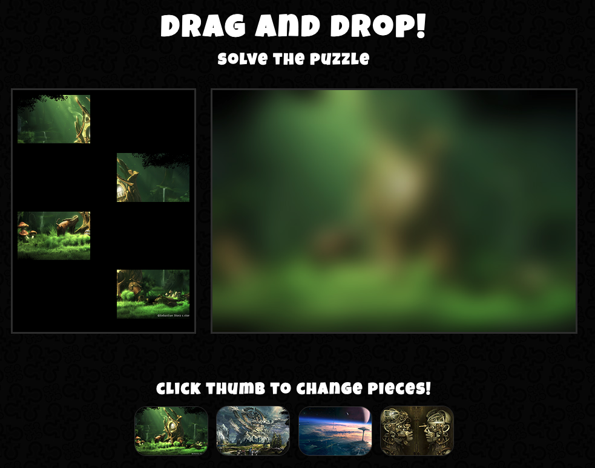

# Troubleshooting Crushing Bugs
The user must drag and drop the puzzle pieces to their proper location. When the spot already has a piece, the piece should not be dropped.

Written Plan: https://docs.google.com/document/d/1aW-SsLslCBe5mwJfHzwNAzxLHFvI_X53gjEuF1s1wsk/edit?usp=sharing

## Requirements
It should fix the following bugs using a newly created branch for each bug:

* The piece should only be dropped to it's proper location
* When the background or puzzle board are changed, the dropped pieces should return to their puzzle piece location

## Contributing

1. Fork it!
2. Create your feature branch: `git checkout -b my-new-feature`
3. Commit your changes: `git commit -am 'Add some feature'`
4. Push to the branch: `git push origin my-new-feature`
5. Submit a pull request :D

## Credits

* Prof Trev

Links:
* [Element.children] (https://developer.mozilla.org/en-US/docs/Web/API/ParentNode/children)
* [Node.removeChild()] (https://developer.mozilla.org/en-US/docs/Web/API/Node/removeChild)
* [return] (https://developer.mozilla.org/en-US/docs/Web/JavaScript/Reference/Statements/return)

## License
Dianne Karla Trabuco
